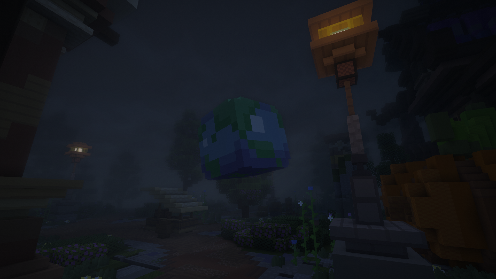
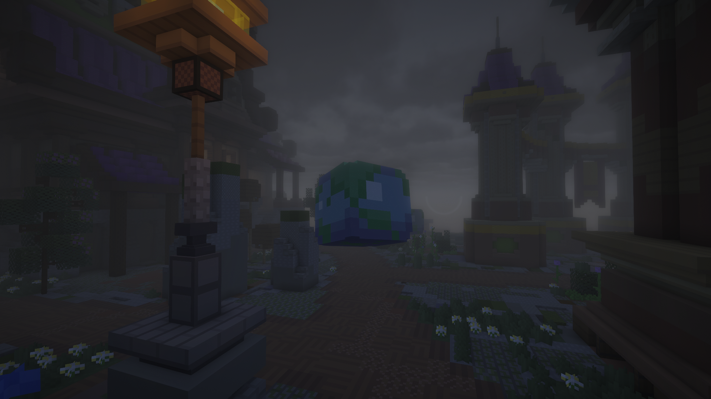
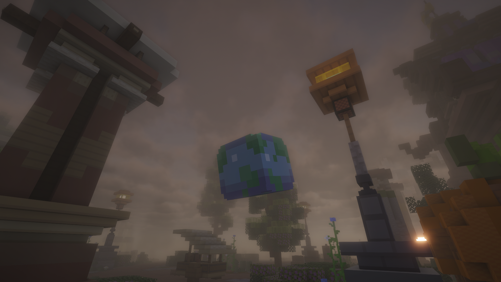

# GiantItemDisplays

[](https://papermc.io/)
[](https://adoptium.net/)
[](pom.xml)
[](LICENSE)

Professional Paper plugin for interactive giant item displays. It uses `ItemDisplay` for the visual model and an invisible `Interaction` entity for reliable clicks, so servers can create floating, rotating, clickable giant items without NMS.

> Submitted by **Ogaki**.

## Preview

<p align="center">
  
  
  
</p>

## Highlights

- Giant item visuals with configurable X/Y/Z scale.
- Smooth spin and optional bobbing animation.
- Click actions executed by console or by the player.
- Simple placeholders: `%player%`, `%uuid%`, `%world%`, `%x%`, `%y%`, `%z%`, `%id%`.
- Per-display permission checks and global click cooldown.
- YAML powered `config.yml`, `lang.yml` and `displays.yml`.
- Safe entity marking with `PersistentDataContainer`.
- Optional collision modes: `none`, `interaction` and `barrier`.
- No NMS. Built on the Paper API.

## Installation

1. Download or build `GiantItemDisplays-1.0.7.jar`.
2. Put the jar in your Paper server `plugins` folder.
3. Start or restart the server.
4. Edit `plugins/GiantItemDisplays/config.yml` and `lang.yml` if needed.

## Build

With Maven installed:

```powershell
mvn clean package
```

Without Maven on PATH, use the included Windows helper:

```powershell
powershell -NoProfile -ExecutionPolicy Bypass -File .\build.ps1 -Clean
```

The compiled jar is created at:

```text
target/GiantItemDisplays-1.0.7.jar
```

## Smooth Animation

The default animation task runs every tick and uses Display interpolation to keep spin and bobbing smooth on the client.

```yaml
settings:
  animation-tick-rate: 1
  display-interpolation-duration: 6
  center-interaction-hitbox: true
  command-dispatch-delay-ticks: 1
```

When upgrading from an older version, the plugin automatically migrates older animation defaults to these smoother values.

For click commands, set only the command that should run after the click:

```text
/gid setcommand rtp console rtp %player%
/gid setcommand shop player warp shop
```

Command values starting with `/` or `./` are normalized before execution.

The clickable `Interaction` hitbox is vertically centered by default, so large hitboxes no longer sit too high above the item.

## DeluxeMenus

Use the built-in helper for DeluxeMenus:

```text
/gid setdeluxemenu rtp menu_name
```

It saves the click action as a console command:

```text
dm open menu_name %player%
```

The command runs one tick after the click event by default, which helps inventory menus open reliably.

## Language Files

The main downloaded plugin uses English by default through `lang.yml`.

The plugin also creates two language templates:

- `lang-en.yml`: English template.
- `lang-ptbr.yml`: Brazilian Portuguese template.

To use Portuguese messages:

1. Start the server once so the plugin creates its folder.
2. Stop the server.
3. Copy the contents of `plugins/GiantItemDisplays/lang-ptbr.yml` into `plugins/GiantItemDisplays/lang.yml`.
4. Start the server again or run `/gid reload`.

To switch back to English, copy `plugins/GiantItemDisplays/lang-en.yml` into `plugins/GiantItemDisplays/lang.yml`.

## Quick Start

Hold the item that should become giant, then run:

```text
/gid create rtp
/gid setscale rtp 3.0
/gid sethitbox rtp 2.5 2.5
/gid setcommand rtp console rtp %player%
```

Players can now click the giant item and the console will execute `rtp <player>`.

## Commands

| Command | Description |
| --- | --- |
| `/gid create <id>` | Creates a display at your location using the item in your hand. |
| `/gid remove <id>` | Removes a display. |
| `/gid list` | Lists all displays. |
| `/gid teleport <id>` | Teleports you to a display. |
| `/gid movehere <id>` | Moves a display to your current location. |
| `/gid setitem <id>` | Updates the visual item from your hand. |
| `/gid setscale <id> <value>` | Sets uniform scale. |
| `/gid setscale3d <id> <x> <y> <z>` | Sets scale per axis. |
| `/gid setrotation <id> <yaw> <pitch>` | Sets base rotation. |
| `/gid setspin <id> <true/false>` | Toggles automatic spin. |
| `/gid setspeed <id> <value>` | Sets spin speed. |
| `/gid setbob <id> <true/false>` | Toggles vertical bobbing. |
| `/gid setbobheight <id> <value>` | Sets bob height. |
| `/gid setbobSpeed <id> <value>` | Sets bob speed. |
| `/gid setcommand <id> <console/player> <command>` | Sets the click command. |
| `/gid setdeluxemenu <id> <menu>` | Opens a DeluxeMenus menu for the clicking player. |
| `/gid setpermission <id> <permission/none>` | Sets the permission required to click. |
| `/gid sethitbox <id> <width> <height>` | Sets the invisible `Interaction` hitbox. |
| `/gid setcollision <id> <none/interaction/barrier>` | Sets the collision mode. |
| `/gid setglow <id> <true/false>` | Toggles glow on the display item. |
| `/gid credits` | Shows the plugin credits for Ogaki. |
| `/gid reload` | Reloads config, language and display storage. |

## Permissions

| Permission | Description |
| --- | --- |
| `giantitemdisplays.admin` | Full access. |
| `giantitemdisplays.create` | Create and edit displays. |
| `giantitemdisplays.remove` | Remove displays. |
| `giantitemdisplays.reload` | Reload plugin files. |
| `giantitemdisplays.interact` | Click displays. |

## Collision Notes

Minecraft `ItemDisplay` entities do not have real physical collision or native click behavior. GiantItemDisplays solves that with two optional layers:

- `interaction`: creates an invisible `Interaction` entity for clicking, without blocking movement.
- `barrier`: creates fake physical collision with barrier blocks only in air blocks. Every created barrier position is saved so the plugin can clean it later.

The barrier mode is useful for special server setups, but `interaction` is the recommended default.

## Credits

Created as a professional public plugin project submitted by **Ogaki**.
